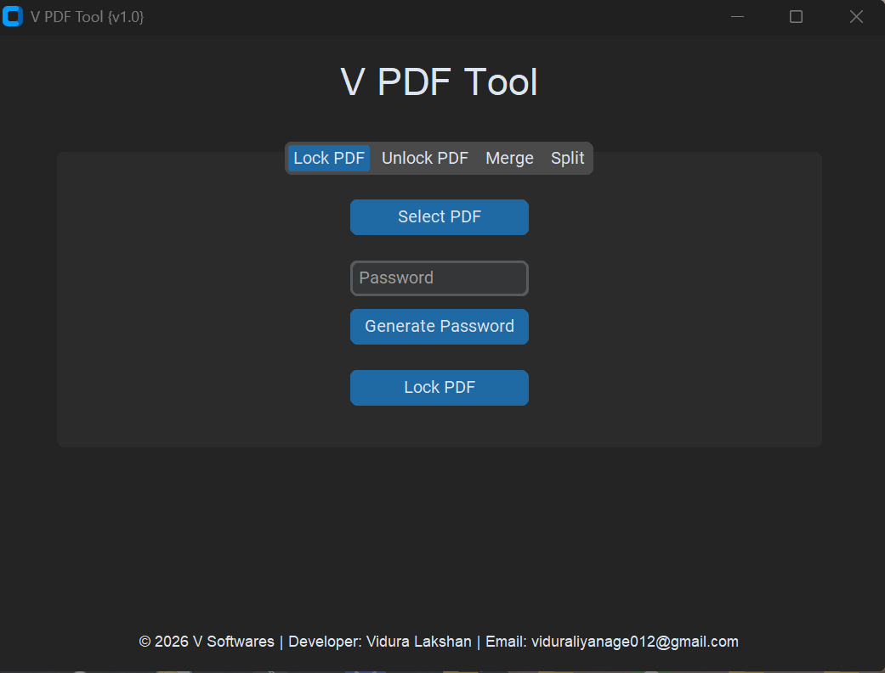

# V-PDF-Tool
                                       🚀 Introducing V PDF Tool {v1.0}! 🚀
                                       
📄 V PDF Tool is a powerful and lightweight desktop application that allows you to lock, unlock, merge, and split PDF files easily with a modern user interface                                      
📄 Say hello to V PDF Tool – your all-in-one PDF solution!

💻 Features:
🔒 Lock PDF Files :
Protect your PDF documents with a secure password.

🔓 Unlock PDFs :
Remove password protection from encrypted PDFs quickly.

📑 Merge PDFs :
Combine multiple PDF files into one single document.

✂ Split PDFs :
Split PDF files into individual pages automatically.

⚡ Auto Password Generator :
Generate strong passwords instantly for better security.

📥 Auto Save to Downloads :
All processed files are automatically saved to your Downloads folder.

                               🎨 Modern & user-friendly interface – easy for everyone!

                                                 ⚡ Fast Processing
                                         Optimized for quick PDF operations.

                                              💻 Lightweight Software
                                    Runs smoothly without heavy system usage.

🛠 Built With
🐍 Python
🎨 CustomTkinter
📄 PyPDF LIBRARY

🌟 Why V PDF Tool?

✔ Simple & beginner friendly
✔ No internet required
✔ Lightweight desktop software
✔ Secure PDF processing
✔ Clean modern interface

                                                     ⭐ Support

                                If you like this project, please give it a star ⭐ on GitHub.
                                 It helps the project grow and motivates further development.

💡 Future Updates

🚀 Drag & drop improvements
🚀 PDF compression
🚀 PDF to Word conversion
🚀 Batch PDF processing
🚀 Dark/Light theme switch

                                        📧 Developer: Vidura Lakshan Liyanage
                                        ✉ Email: viduraliyanage012@gmail.com

                                    💡 Download now & simplify your PDF workflow!

Release Version 01 :

DOWNLOAD : https://www.mediafire.com/file/jq3evzwown59gsb/V_PDF_TOOL_SETUP.exe/file 

#PDFTool #PythonProject #OpenSource #CustomTkinter #PythonGUI #PDFSecurity #DesktopApp #SoftwareDevelopment #Programming #PythonDeveloper

## 📸 Screenshot 

